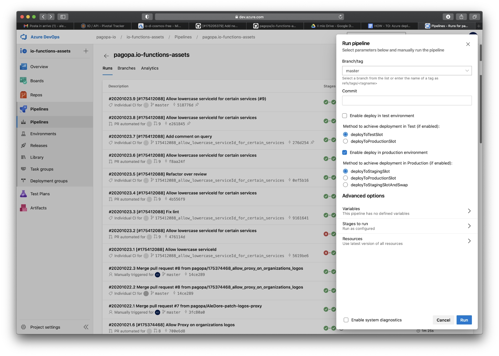
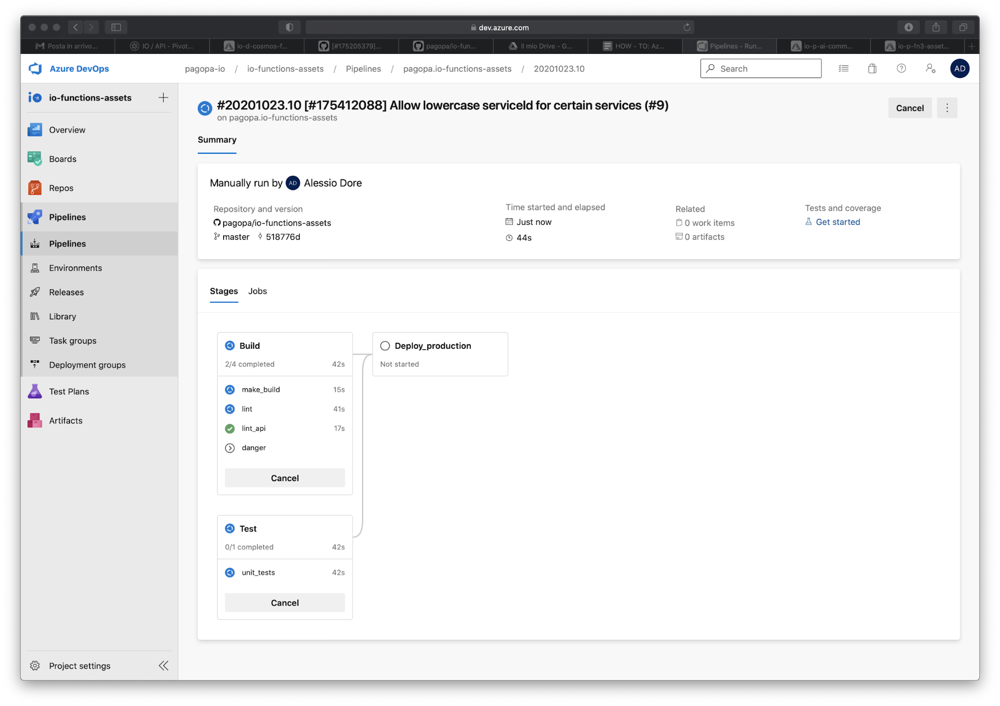
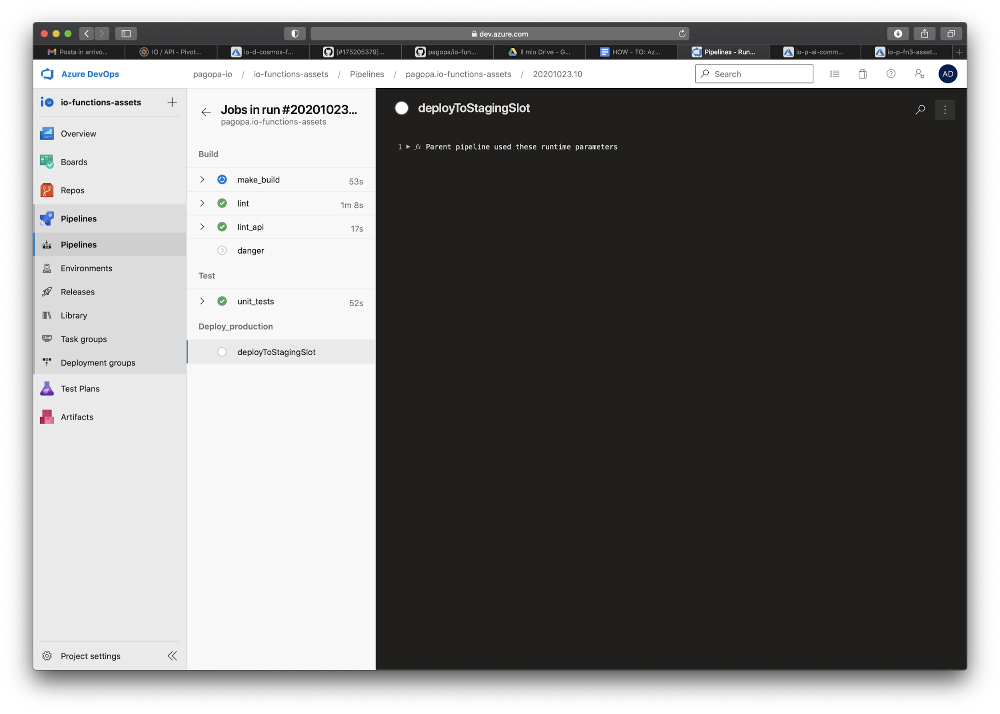
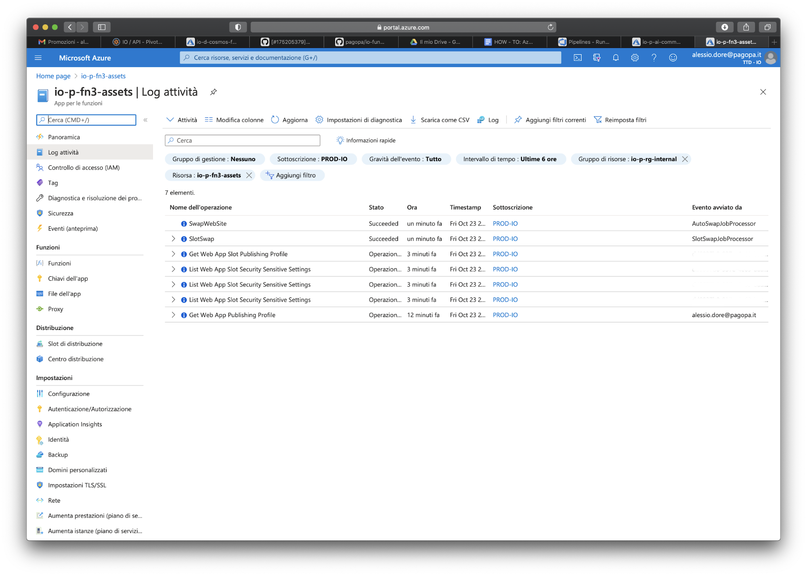

## Azure Deploy

### Context
This little guide is intended for all pagoPA's devops team members, or even for all that have access and permissions to run a pipeline through [Azure DevOps](https://dev.azure.com/pagopa-io/). It explains in a step-by-step approach what to do, while facing deploy operations in our production environment.

### Prerequisites
Before giving a try and follow this guide, please check the following requirements:
- [Azure CLI](https://docs.microsoft.com/it-it/cli/azure/install-azure-cli) is installed locally on your Mac
- You have the permission to run a pipeline on Azure DevOps
- You have access to production' s resources on [Azure Portal](https://portal.azure.com/#home)
- You can publish a new release on Github's repos

### Let's start
In order to achieve our goals in this guide we will use [io-functions-assets](https://github.com/pagopa/io-functions-assets) as example's repository, so let's assume that we want to deploy a new version of this repo in prod environment.

### Check code changes
The first question you should answer is: **What is the list of changes (i.e *commits*) and differences between last released version and the current I want to deploy?**
To answer this question you have two possible choices:

- Run `/iodeploy` into slack to see how many changes are waiting to be deployed for your target project (namely: how many commits have been merged into `master` branch since last version was released)
- Go to [Azure DevOps](https://dev.azure.com/pagopa-io/) and then:
  1. Click on ***io-functions-assets***' s project 
  2. Go to ***Pipelines*** and select a pipeline from list (i.e *pagopa.io-functions-assets*) 
  3. Check in pipelines' runs list the last run that has reached the ***deployToProduction*** stage, or in other words, which run has all three checkmarks enabled :) 
  4. Navigate through the commit tag's link, tied up to the pipeline's run, and copy the commit identifier (namely ***commitID***).
  5. Open a new tab in your browser and type https://github.com/pagopa/io-functions-assets/compare/***commitID***...master. You should see a comparison diff list on github like the following 

After code checks are enough to be sure that selected changes are ready to be deployed, we ***must*** create a new release on Github (check out if it is a minor or a major) and proceed with next steps.

### Run Azure Pipeline

Now you are ready to run your first pipeline so:
1. Open [Azure DevOps](https://dev.azure.com/pagopa-io/)
2. Click on ***io-functions-assets***' s project
3. Go to ***Pipelines*** and select a pipeline from list (i.e *pagopa.io-functions-assets*)
4. Click on ***Run Pipeline*** button, you should see a right bar menu like this 
5. Leave options unchanged and then click on ***Run*** button
6. Monitor Pipeline's job status on pipeline's jobs detail pages:  

### Monitor Production logs

While Pipeline is running, you have to monitor production logs to check if there are errors during deploy or in a post deploy phase. In order to achieve this checks, you have to perform other several operations.

#### Check activity log
- Login to [Azure Portal](https://portal.azure.com/#home) and search for the resource you are interested to monitor (in this case ***io-p-fn3-assets***)
- Select ***Activity Log*** and take care about swap operations (from staging to production)   

#### Check Application Insights logs
- Login to [Azure Portal](https://portal.azure.com/#home) and search for application insights (***io-p-ai-common***)
- Open ***Errors*** section and check if there are error spikes after your pipeline has finished all its steps and slot's swap takes place (from staging to production) 

If there are no relevant errors after deploy, it sounds good :) 

#### Check webapp resource logs
- Open a terminal and type `az login` 
- After redirecting to Azure portal and terminate login step (It shouldn't take a long time, 'cause you're already logged in, if you follow previous instructions)
- Type `az webapp log tail --resource-group io-p-rg-internal --name io-p-fn3-assets` and check if there are relevant errors on webapp logs.

## Test in production environment
Once deploy's phase is terminated and you are sure there are no errors in production while monitoring logs, it's a good practice to test directly what has been released (if possible by calling API's directly from Postman or cURL).

**Last but not least:** check if others core IO functionalities still work after your release (if your release can impact them).

**Congratulations! You have terminated your first deploy in our production environment using Azure pipelines!**