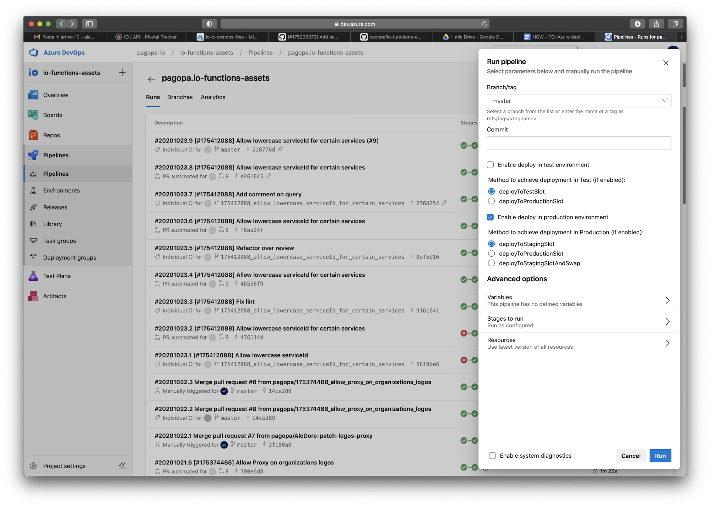
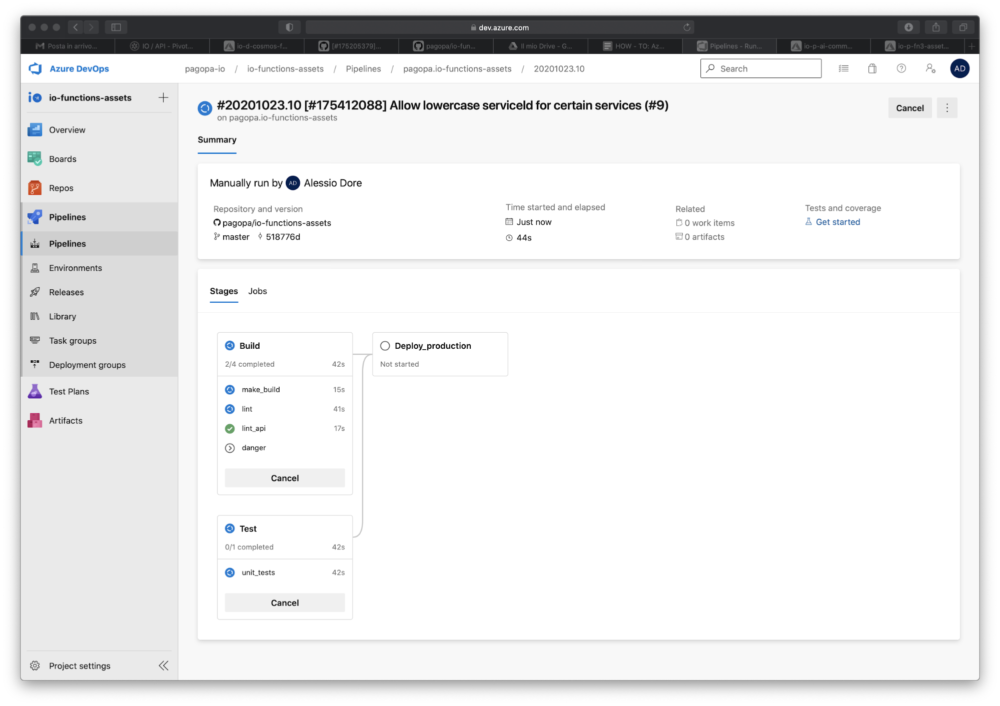
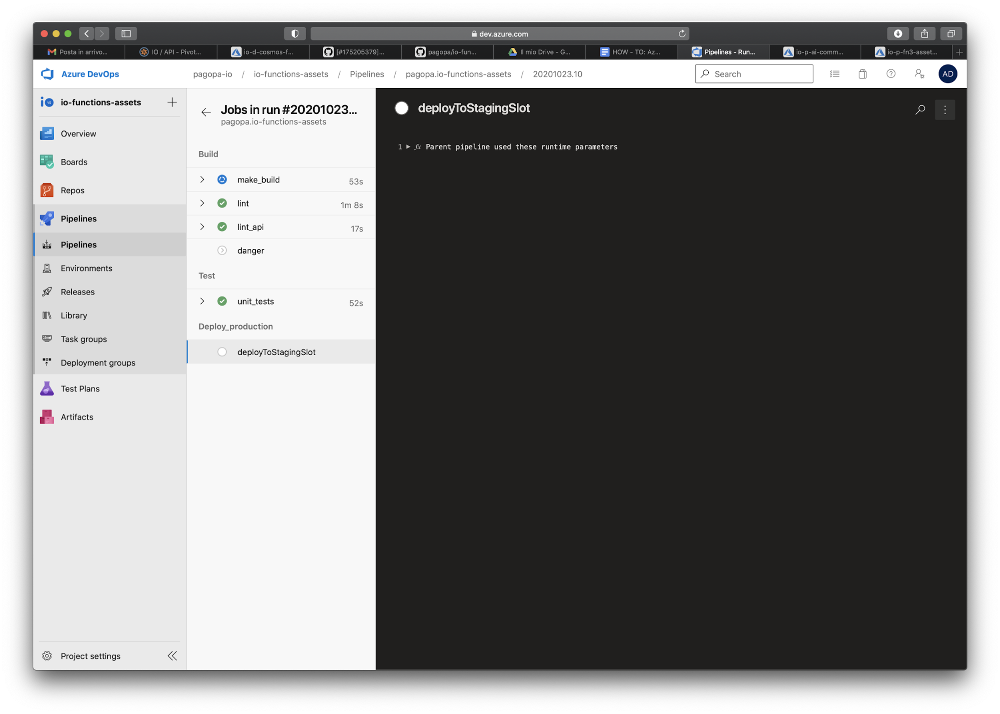
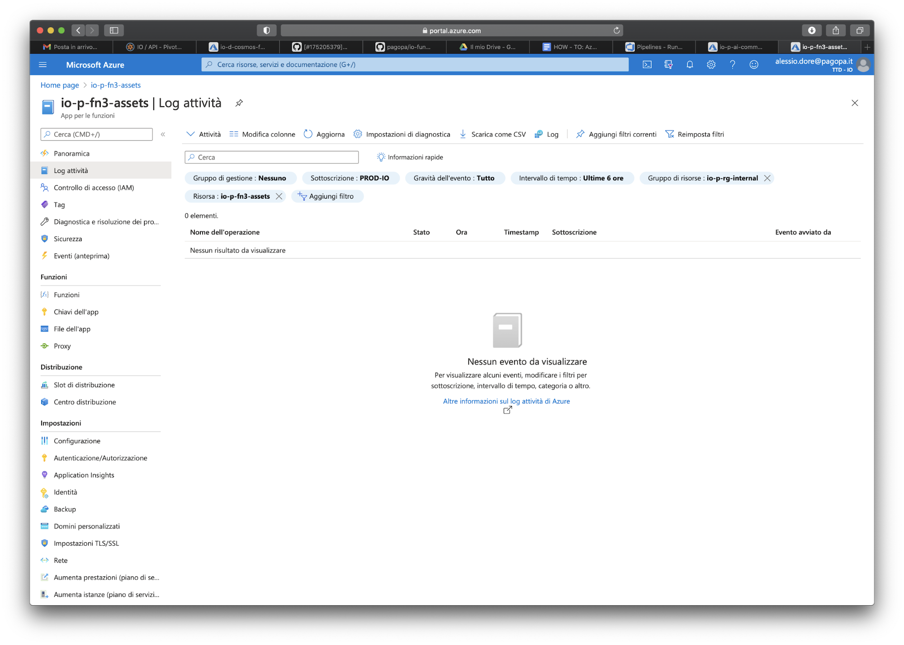
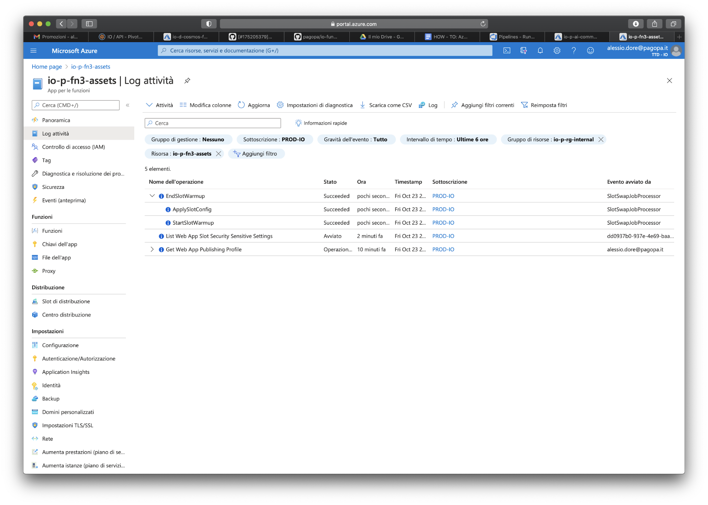
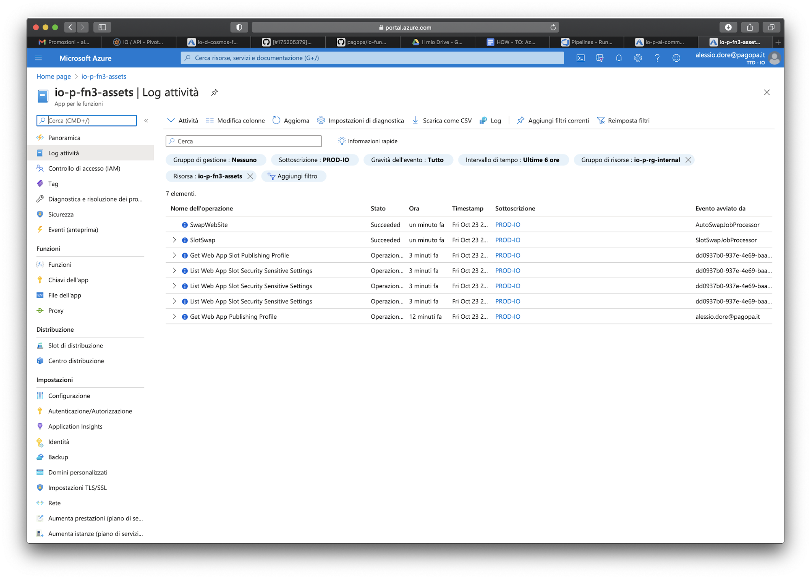
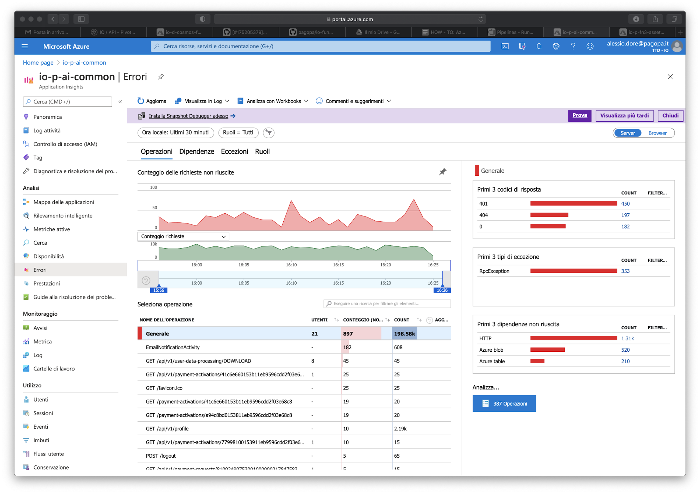
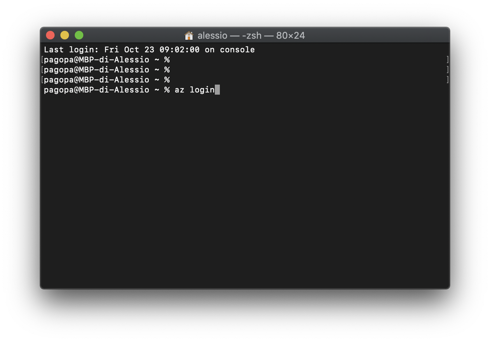
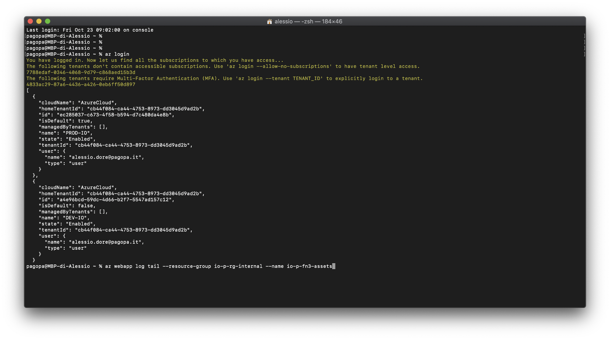

## Context

This guide is intended for all tech team members that need to deploy into production
running the pipelines through the [Azure DevOps](https://dev.azure.com/pagopa-io/) portal.

Ask for permession in #dev_io if you are willing to deploy some artifacts
(ie. backend, functions) into the IO platform production environment.

## Prerequisites

Please check the following requirements:

- [Azure CLI](https://docs.microsoft.com/it-it/cli/azure/install-azure-cli) is installed locally
- You have the permission to run a pipeline on Azure DevOps
- You have access to production services on the [Azure Portal](https://portal.azure.com/#home)
- You can create new releases on GitHub

We are going to take the deployment of [io-functions-assets](https://github.com/pagopa/io-functions-assets)
as an example, assuming that we want to deploy a new version of the code in the production environment.

## Lookup code changes

The first question you should answer is: **What changes needs to be deployed yet?**

To answer this question we have implemented a Slack command:
run `/iodeploy` into any Slack channel to see how many changes are waiting to be deployed for your target project
(namely: how many commits have been merged into the `master` branch since the latest version was released).
For each project you'll get a link to the GitHub code diff between the release candidate (HEAD)
and the latest version released.

## Create a GitHub release

After checking code changes you **_must_** create a new release on GitHub
(check out if it is a minor or a major) before proceed with the next step.

## Run the pipeline

1. Navigate to the [Azure DevOps](https://dev.azure.com/pagopa-io/) portal
1. Click on **_io-functions-assets_**' s project
1. Go to **_Pipelines_** and select a pipeline from list (i.e _pagopa.io-functions-assets_)
1. Click on **_Run Pipeline_** button, you should see a right bar menu 
1. Leave all options unchanged and then select the **_Run_** button
1. Monitor the job status on the pipeline jobs detail pages:  

## Monitor production logs

While the pipeline is running, and after the code has reached production,
monitor the production logs to lookup any error that may have been caused by the deploy.

You must be logged in into the [Azure Portal](https://portal.azure.com/#home)
and have the right to access Application Insights and the service you're deploying to.

### Check the activity log

1. Search for the service you are deploying to (in this case **_io-p-fn3-assets_**)
1. Select **_Activity Log_** and take care about the swap operations (from staging to production)

### Check Application Insights logs

1. Search for Application Insights (**_io-p-ai-common_**)
1. Open the **_Failures_** section (left menu) and check if there are error spikes after the slots are swapped (from staging to production)

#### Check the application logs

1. Open a terminal and type `az login` 
1. Type `az webapp log tail --resource-group io-p-rg-internal --name io-p-fn3-assets` and check if there are relevant errors

## Test in production environment

Once the deploy phase is finished and you are confident that there are no relevant errors in production,
try to make some integration tests against what has been just released (ie. by calling the API directly from Postman or cURL);
aside, check if the other core IO functionalities are still working (ie. manually triggering events using the IO mobile application).

**Congratulations! You have terminated your first deploy in our production environment using Azure pipelines!**
