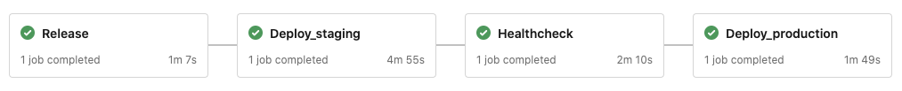
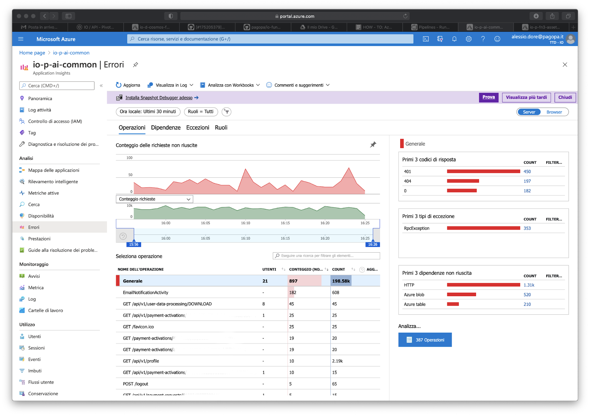

## Context

This guide is intended for all tech team members that need to deploy into production
running the pipelines through the [Azure DevOps](https://dev.azure.com/pagopa-io/) portal.

Ask for permession in #dev_io if you are willing to deploy some artifacts
(ie. backend, functions) into the IO platform production environment.

## Prerequisites

Please check the following requirements:

- [Azure CLI](https://docs.microsoft.com/it-it/cli/azure/install-azure-cli) is installed locally
- You have the permission to run a pipeline on Azure DevOps
- You have access to production services on the [Azure Portal](https://portal.azure.com/#home)
- You can create new releases on GitHub

We are going to take the deployment of [io-functions-assets](https://github.com/pagopa/io-functions-assets)
as an example, assuming that we want to deploy a new version of the code in the production environment.

## Lookup code changes

The first question you should answer is: **What changes needs to be deployed yet?**

To answer this question we have implemented a Slack command:
run `/iodeploy` into any Slack channel to see how many changes are waiting to be deployed for your target project
(namely: how many commits have been merged into the `master` branch since the latest version was released).
For each project you'll get a link to the GitHub code diff between the release candidate (HEAD)
and the latest version released.

## Run the pipeline

1. Navigate to the [Azure DevOps](https://dev.azure.com/pagopa-io/) portal
1. Click on **_io-functions-assets_**' s project
1. Go to **_Pipelines_** and select the deploy pipeline from list (i.e _pagopa.io-functions-assets.deploy_)
1. Click on **_Run Pipeline_** button, you should see a right bar menu 
1. Check the options and value them according to the scenario you are in (see below); when ready, press the **_Run_** button
1. Monitor the job status on the pipeline jobs detail pages:  

The deploy pipeline is configured to creare a release itself, so no previous operations are needed in order to deploy a new version of the application.

A common deploy pipeline will look like the following:

### Scenario: deploy new features

The most common case: new code is added to `master` branch and you want to ship it. On the pipeline option screen, do the following:
1. Select `master` as base `branch/tag`
1. Choose between `major`, `minor` or `patch` depending on the kind of changes introduced; application version will be bumped accordingly 
1. Leave stages untouched

The pipeline will bump the application version, create a new release on project's Github page, build and deploy the application using a _staging_ slot to have a warm start.

### Scenario: deploy an existing version

This scenario happens when it is needed to roll back the application to a previous version (or you want to retry a failed deploy without creating a new release). On the pipeline option screen, do the following:
1. Select `refs/tags/v{VERSION}-RELEASE` as base `branch/tag`, where `{VERSION}` is the semver number to reference code to.
1. Ignore the choice between `major`, `minor` or `patch`, as no release will be created.
1. Leave stages untouched.

The `Release` stage will be executed successufully anyway, but no release will be created. The application is then built and deployrd using a _staging_ slot to have a warm start.

## Monitor production logs

While the pipeline is running, and after the code has reached production,
monitor the production logs to lookup any error that may have been caused by the deploy.

You must be logged in into the [Azure Portal](https://portal.azure.com/#home)
and have the right to access Application Insights and the service you're deploying to.

### Check the activity log

1. Search for the service you are deploying to (in this case **_io-p-fn3-assets_**)
1. Select **_Activity Log_** and take care about the swap operations (from staging to production)

### Check Application Insights logs

1. Search for Application Insights (**_io-p-ai-common_**)
1. Open the **_Failures_** section (left menu) and check if there are error spikes after the slots are swapped (from staging to production)

#### Check the application logs

1. Open a terminal and type `az login` 
1. Type `az webapp log tail --resource-group io-p-rg-internal --name io-p-fn3-assets` and check if there are relevant errors

## Test in production environment

Once the deploy phase is finished and you are confident that there are no relevant errors in production,
try to make some integration tests against what has been just released (ie. by calling the API directly from Postman or cURL);
aside, check if the other core IO functionalities are still working (ie. manually triggering events using the IO mobile application).

**Congratulations! You have terminated your first deploy in our production environment using Azure pipelines!**
